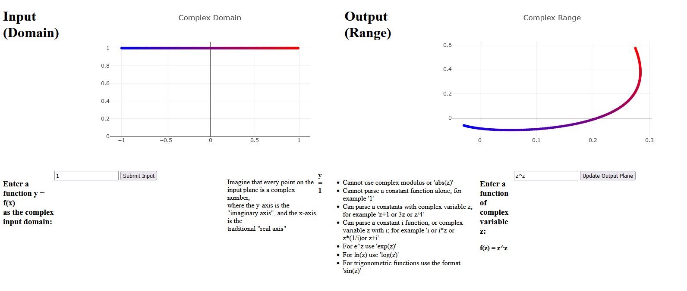

Using mathjs and Plotly.js to view input and associated output of complex funcions f(z)

Blue represents first drawn; red represents last drawn. Generates f(x) in increasing x order from -1 to 1.

Hosted using Vercel [here](https://complex-plots.vercel.app/)

Preview/Example: 

You will have to refresh the app/page every time you wish to generate a new plot;
calling Plotly.react() isn't behaving as advertised and I am trying to fix this
without installing react.js ideally